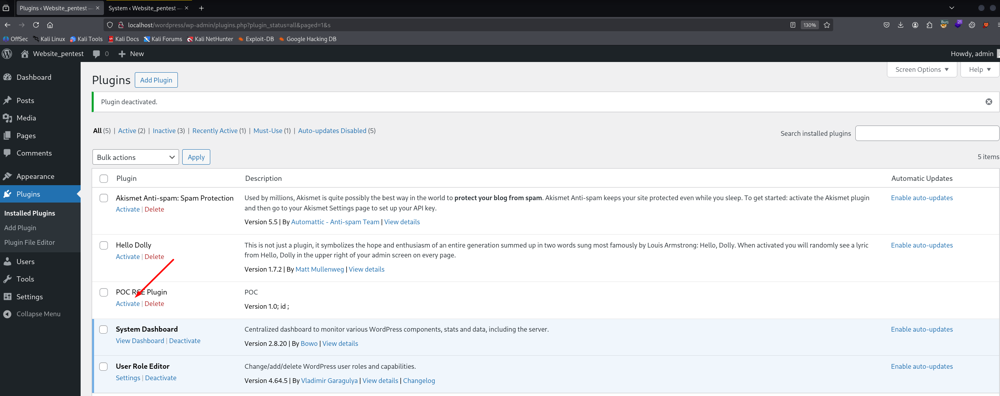
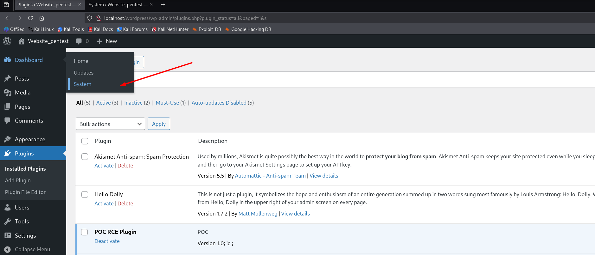
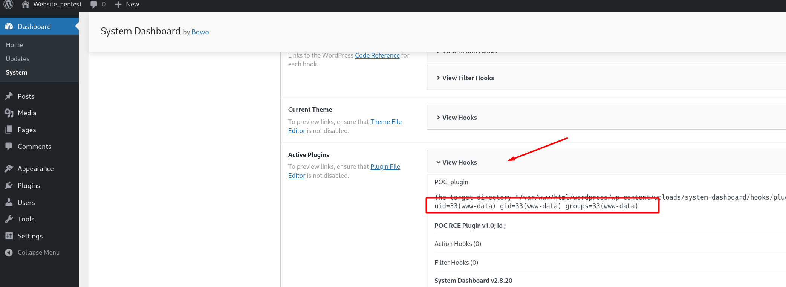
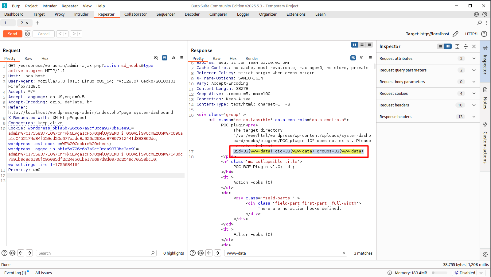

#  Command Injection in Plugin System Dashboard (Funtion-sd_hooks)

**Vulnerability Type:** Command Injection (RCE)

**Affected Function:** `sd_hooks` (Plugin: System Dashboard)

**Impact:** Authenticated users with `Subscriber` or higher privileges have permission `manage options` can trigger arbitrary system command execution due to unsanitized use of plugin metadata (e.g., `Version` field). Successful exploitation results in `Remote Code Execution (RCE)` under the web server’s context, potentially leading to full compromise of the affected host.

**CVSS v3.1 Score:** 8.8 (High)  
**Vector:** AV:N/AC:L/PR:H/UI:N/S:C/C:H/I:H/A:H 

-------------------------
## Description

In `sd_hooks`, plugin metadata (Version) and directory values are concatenated into a shell command without sanitization:

``` php
$shell_command = 'cd ' . plugin_dir_path( __DIR__ ) .
                 ' && chmod +x ./vendor/johnbillion/wp-hooks-generator/src/generate.php' .
                 ' && ./vendor/johnbillion/wp-hooks-generator/src/generate.php' .
                 ' --input=' . $plugins_path . $directory_name .
                 ' --output=' . $plugins_hooks_dir_path . '/' . $directory_name . '-' . $plugin_version . ' 2>&1';

$shell_output = shell_exec($shell_command);
```

Because `$plugin_version` is directly controlled by plugin metadata, an Admin user can upload or edit a plugin with malicious version string to inject commands.

## Proof of Concept (PoC)

**Step1: Prepare Malicious Plugin**.
 
The tester creates a custom plugin with a malicious `Version` value in its header. Examplen:

``` php
<?php
/**
 * Plugin Name: PoC RCE
 * Version: 1.0; id ;
 */
```


**Step2: Trigger Vulnerable Functionality.**    

The tester navigates to the plugin interface: `Hooks → View Hooks`



When the vulnerable function sd_hooks processes the plugin metadata, the malicious Version string is concatenated into a shell command and executed.



## Impact

Confidentiality: Read sensitive system and WordPress files

Integrity: Modify/delete application or system files

Availability: Execute destructive commands, causing DoS

Overall: Remote Code Execution (RCE) with Admin-level precondition

## Recommendations

- Sanitize inputs: Apply strict regex filtering on $plugin_version and $directory_name (allow only [a-zA-Z0-9]).

- Escape shell arguments: Use escapeshellarg() before passing variables into $shell_command.

- Remove shell_exec: Replace with PHP native APIs or secure process wrappers.


## Video POC
If you're unable to reproduce the issue exactly as described in the report, please refer to the following video demonstration (PoC) for a clear reproduction scenario:

https://www.youtube.com/watch?v=C143wO_N40I
